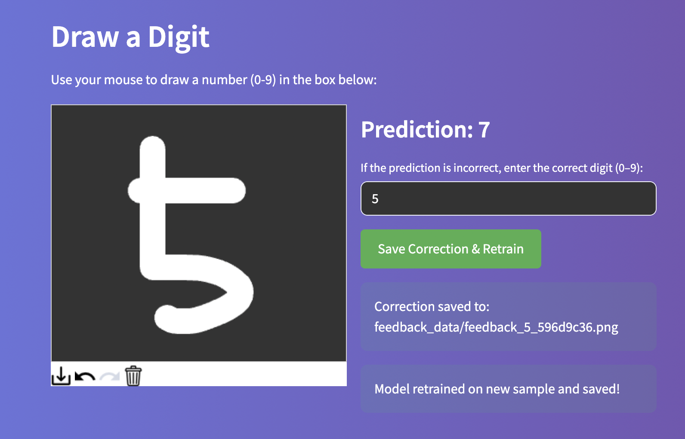

# 🔢 Smart Digit AI

A Streamlit app that recognizes hand-drawn digits using a neural network trained on the MNIST dataset.  
You can correct its mistakes, and the AI will learn and improve in real time!

 
 
 
 

---

## ✨ Features

- ✏️ Draw digits directly on a canvas
- 📊 Get instant AI predictions
- 🔁 Provide correct labels to improve accuracy
- 💾 Model saves and reloads automatically
- 🎨 Beautiful gradient UI and responsive layout

---

## 🚀 Getting Started

### 1. Clone this repository

```bash
git clone https://github.com/your-username/smart-digit-ai.git
cd smart-digit-ai
```

### 2. Set up a virtual environment

```bash
python -m venv venv
source venv/bin/activate  # Windows: venv\\Scripts\\activate
```

### 3. Install dependencies

```bash
pip install -r requirements.txt
```

### 4. Run the app

```bash
streamlit run mnist_app.py
```

---

## 📦 Requirements

- Python 3.8+
- streamlit
- tensorflow
- numpy
- pillow
- matplotlib
- streamlit-drawable-canvas

(Install with `pip install -r requirements.txt`)

---

## 📘 License

MIT License  
© 2025 [zuochan]

